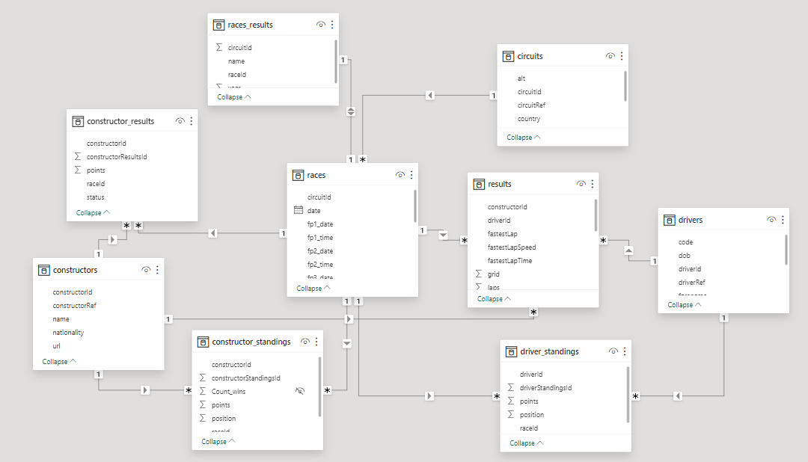

# Dashboard de Fórmula 1 en Power BI
## Descripción del Proyecto
Este proyecto consiste en la creación de un dashboard interactivo en Power BI enfocado en la Fórmula 1. El dashboard consta de cuatro pestañas que proporcionan información detallada sobre datos relacionados con las escuderías, pilotos, circuitos y predicciones para Fernando Alonso y el equipo Aston Martin.
## Pestaña 1: Escuderías
En esta pestaña, se presenta una visión general de las escuderías con datos clave, como puntos acumulados por año, victorias por equipo y el número de "Did Not Finish" (DNF). Los usuarios pueden filtrar la información por equipo y año para obtener una perspectiva detallada de su interés.
## Pestaña 2: Pilotos
Aquí, los usuarios pueden explorar datos a nivel de piloto, incluyendo puntos históricos, victorias y detalles sobre la carrera profesional de cada piloto. La información es interactiva y se puede filtrar para analizar específicamente a un piloto en particular.
## Pestaña 3: Circuitos Mundiales
Esta pestaña muestra un mapa interactivo que permite filtrar por país para ver los circuitos dentro de cada uno. Proporciona detalles sobre los ganadores por año, vueltas rápidas y el número de Grandes Premios disputados en cada circuito.
## Pestaña 4: ¿Cómo?
En esta sección más lúdica, se presentan datos específicos sobre Fernando Alonso y el equipo Aston Martin, incluyendo predicciones sobre dónde podrían ganar la próxima carrera. Utiliza visualizaciones atractivas para hacer que la experiencia sea más divertida y emocionante.
Instrucciones de Uso
* 		Descarga e instala Power BI Desktop desde powerbi.microsoft.com.
* 		Abre Power BI Desktop y carga el archivo del proyecto.
* 		Explora las pestañas usando los filtros y las interacciones proporcionadas para obtener información detallada sobre escuderías, pilotos, circuitos y predicciones.
¡Disfruta explorando el fascinante mundo de la Fórmula 1 a través de este completo dashboard en Power BI!

## Modelo de datos:

